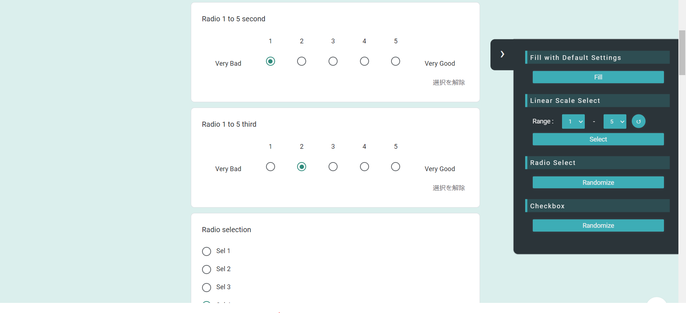

# Quick Google Forms v0.1.2
A script that adds a side bar tool to hasten the process of filling up google forms

## Features
Works on the following question types:
- [x] Multiple Choice (Radio Buttons)
- [x] Linear Scale
- [x] Checkboxes

To be added:
- [ ] Multiple Choice Grid (Radio Buttons)
- [ ] Checkbox Grid 
- [ ] Short Answer
- [ ] Paragraph
- [ ] Dropdown
- [ ] Date 
- [ ] Time

Uncertain:
- [ ] File Upload

## Installation (Around 2 Min only)
1. Install a userscript manager like [Tampermonkey](https://www.tampermonkey.net/) (A chrome extensioon)
2. Click on [this](https://github.com/HageFX-78/QuickGoogleForms/raw/main/QuickGoogleForms.user.js) and install.
3. Open any google form and the tool will appear on the right.
4. Enjoy!

### Known Issues
- ~~Script won't load of first load, refresh the page and the tool will appear.~~

### How it looks like (v0.2.1):

